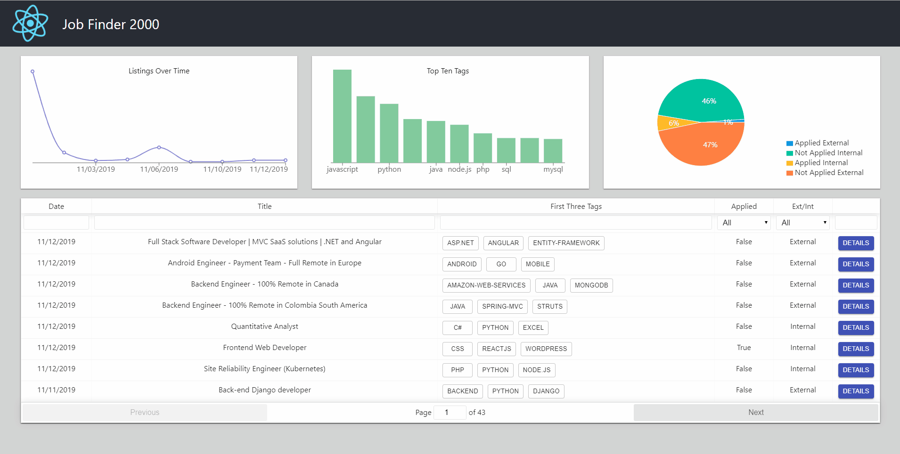

# Job Finder 2000

Several small projects in one repository.

- A scrapy project to crawl StackOverflow.com/jobs and get relevent information on openings.
- A frontend to see what is new and view some data on what I have already applied to compared to what is still available.

The frontend was created with [Create React App](https://github.com/facebook/create-react-app).

## Available Scripts

In the project directory, you can run:

### `scrapy crawl jobs`
to get data.

or

### `cd ui/`
### `npm run dev`

Runs the frontend app in the development mode. 
Open [http://localhost:3000](http://localhost:3000) to view it in the browser.
